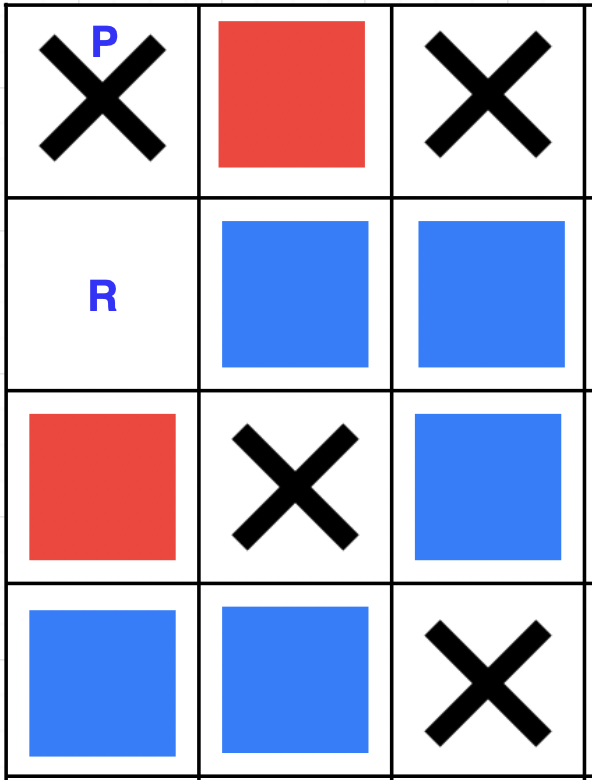
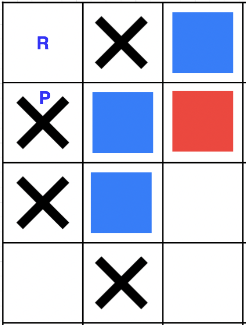

# Aenigma
## An Hadron player
### Authors: Teodoro Sullazzo, Maria Pia Zupi, Vanessa Bruno, Simone Squillace

This repository contains the source code of the Hadron player, winner of the 2022/2023 AI tournament at University of Calabria.

The code created by us is contained in the heuristic folder, i.e. the **Aenigma** class.

The rest of the code was provided by the organizers of the tournament.

# 1. Used Strategy

## 1.1. Special Moves

The adopted technique is based on the concept of special move:

### _Definition 1_

Given a player X and his opponent Y, a special move (R) is an available position that has an unoccupied and unplayable adjacent position (P), such that:
1. if X plays in R, P will no longer be playable;
2. if Y plays in R, P becomes playable;
3. if P becomes playable, neither X nor Y can create new moves starting from P.

Regarding point 1, to define the "non-playability" condition, it is necessary to specify that for this to occur, the other positions adjacent to P (except R) must already be occupied by pawns or no longer "unlockable" (as there could be cases of chains of positions capable of unlocking an apparently blocked position).

A graphic example is shown below:

    <figure>
        
        <figcaption>Figure 1: Special move</figcaption>
    </figure>
    <figure>
        
        <figcaption>Figure 2: Fake special move</figcaption>
    </figure>

Looking at Figure 1, in the case where the red player inserts the pawn in position R, P will remain unplayable; conversely, if the blue player uses R, P becomes playable.

In an endgame situation, R becomes an invaluable resource for the red player as it gives him/her great flexibility in terms of the parity/disparity of available moves. Assuming that R is the only available move, if the player who has to make the move is red, he/she will win the game; if it is blue who has to play, he/she will give red another move on the next turn. Regardless of the turn, red would be able to win.

## 1.2. Moves Parity
Another aspect taken into consideration for the definition of the heuristic is the parity of the number of available moves. When the specials of the two players balance each other out, the parity/disparity of the remaining number of moves will determine an advantage of one player over the other. In fact, a player should have an odd number of available moves before making his/her own move.

## 1.3. Limits of the Strategy
What has been seen above, both with regard to special moves and parity, has been implemented in a weak form. The search for special moves created does not actually achieve the strong form of "non-playability", limiting itself to controlling the first level of neighbors (it does not take into account chains of moves). The parity strategy, on the other hand, does not take into account the complexities arising from moves capable of generating or destroying other moves. The reason for this is the need to limit the complexity of the heuristic on the one hand and, on the other hand, the empirical tests carried out with different heuristics from which the present one emerged as the winner.

# 2. Implementation
The implementation includes, in addition to the "evaluateBoard" method (part of the provided interface), a "checkSpecial" method that checks if position (i,j) is a special move, also indicating its ownership (i.e., which player). There are also "evaluatePos" and "validMove" methods; these are two auxiliary methods that allow the value of a position to be calculated (1 if occupied by a white pawn, 0 by a black pawn, -1 if the position is empty and usable, -2 if empty and blocked), and check whether position (i,j) is a valid move. Worth noting is the "evaluateBoard" method in which the board is scanned in search of special moves. In particular, an integer is maintained that counts the number of available moves in order to signal an endgame condition if that value is ultimately zero.

## 2.1. Two-phase heuristic
The heuristic has two different behaviors based on the number of remaining moves. If this value is ≥ 10, only the part related to special moves is considered, otherwise, the parity component is also considered. To implement this behavior, weights (i.e. $w_1$ and $w_2$) are used, which are initially set to 1 and 0, and in the second phase to 0.5 and 0.5. It is assumed that towards the end-game there is less presence of generative or destructive moves, and there will probably be basic moves that, once consumed, have no effect.

## 2.2. Randomization
It was also decided to add a random number between 0 and 1 to the final value returned by the heuristic. In this way, the algorithm tends to have a different behavior on moves with equal evaluation. Following empirical tests, it has been observed that this addition is able to improve the overall behavior of the player.

## 2.3 Hyper-parameter search
The values of $w_1$ = 0.5, $w_2$ = 0.5, and $t$ = 10 ($t$ indicates the number of moves from which the parity heuristic is activated) were obtained through a "natural selection" approach. N players were taken, whose hyper-parameters at time $t_0$ were chosen randomly ($w_i$ ∈ [0, 1], $t$ ∈ [0, 82]). Then, they were made to play against each other. In the next step, the two best ones (i.e. those who obtained the best win/loss ratio) were kept for the current tournament, and the others were replaced with players with random values. All of this was done for a sufficient number of generations (in order to notice some form of convergence). The values presented above were the best ones.

# 3. Conclusions
The final formula used is as follows:

$$w_1(\#moves)\cdot hSpecialMoves + w_2(\#moves) \cdot hParity + Random(0,1)$$